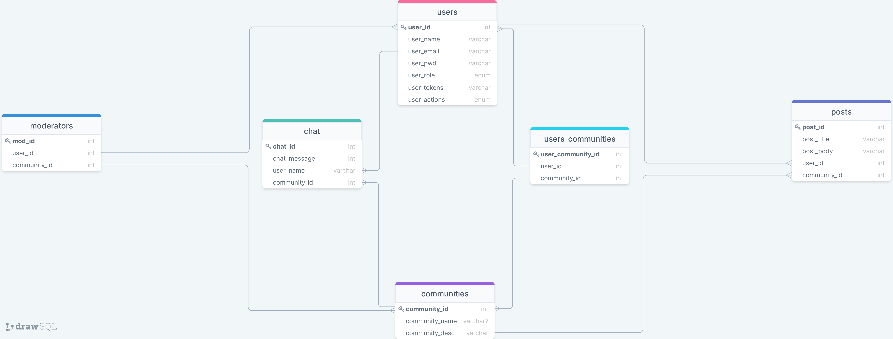
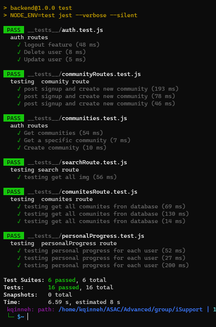

# iSupport

A habit building platform that connects communities that share the same goal together, offering them a wide range of features such as creating communities, progress tracking, solo-goals and statistics.

Team Name: **Error Makers**

## Team Members:

- Karam Al-Qinneh
- Moath Abu Hamad
- Obeida Akilan
- Salam Mustafa
- Hala Al-Masharfeh

## Project Overview & Problem Domain

- We've noticed as a team that all of us have tried to build a new habit or get rid of an existing one but failed at least once in our lifetime. After researching the reasons we found that lack of commitment is the main reason behind this. Therefore the rule is simple enough. Commit to a personal or professional goal for 21 straight days. After three weeks, the pursuit of that goal should have become a habit. Once you've established that habit, you continue to do it for another ninety days. But how can you withstand all this span while you are suffering from the lack of commitment issues, encourgement is the asnwer if you get the right support and surround yourself with people how have the same goal. Support communities have been there since always but not everybody has access to them or some people have unique habits that only a few people around the world have them so it would be great to connect them together and provide access to the support communities for those who can't join them and that is exactly our goal.

- This is a server for a yet to come full-stack application you can only access the API endpoints to get all the results needed for now.

## Project Wireframes

- Home Page WireFrame:  
  

- Browse Communities Page WireFrame:  
  

- Community Page WireFrame:  
  

## User Stories

- The user should be able to sign up / login to create his account and save all of his data in the database.

- As a user I should be able to interact with other community members thus there should be a group chat feature but each community should be separated from the other. The user doesn't want to chat with all the other user he is only concerned with the ones that have a common goal with him.

- As a user I should have different ways to access the communities either by search or some suggestions, a good suggestion is trending communities. Trending communities are the ones with most posts in the recent time.

- As a user I sould be ale to join an existing community or create a one if the habit he wants to build a one that doesn't already exists.

- The user should be a ble to retrieve all the posts within the community he joins and he should also be able to post some also.

- Each community should have a moderator that can edit and delete the community posts.

- As a user I should be able to see the leaderboard of the community this should have all the users who are considered highly active in the community.

- As a user I should be able to track my own progress and contributions to the community.

- As an admin I should be able to delete a community if there were some suspicious behavioral patterns within the community.

- As a user I should be able to get all communities and browse them to get inspired for a new good habit.

## Domain Modeling

## Database Schema Diagram

## Unit Testing

