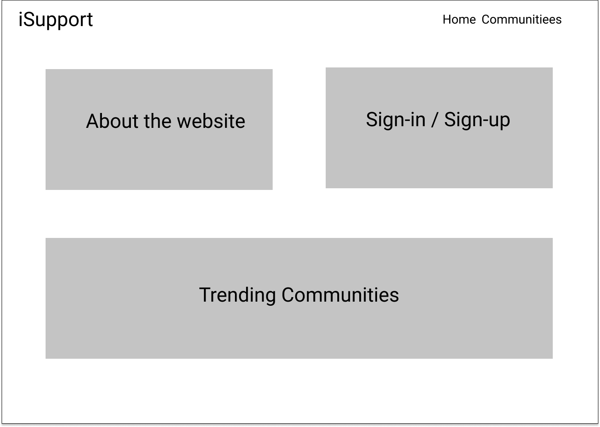
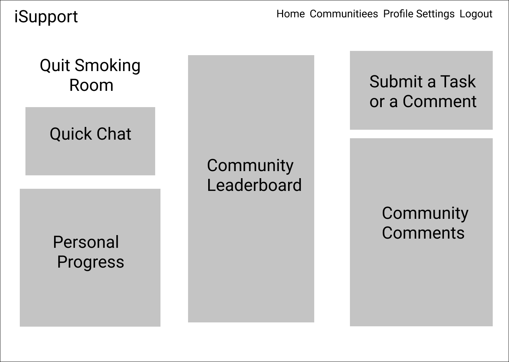
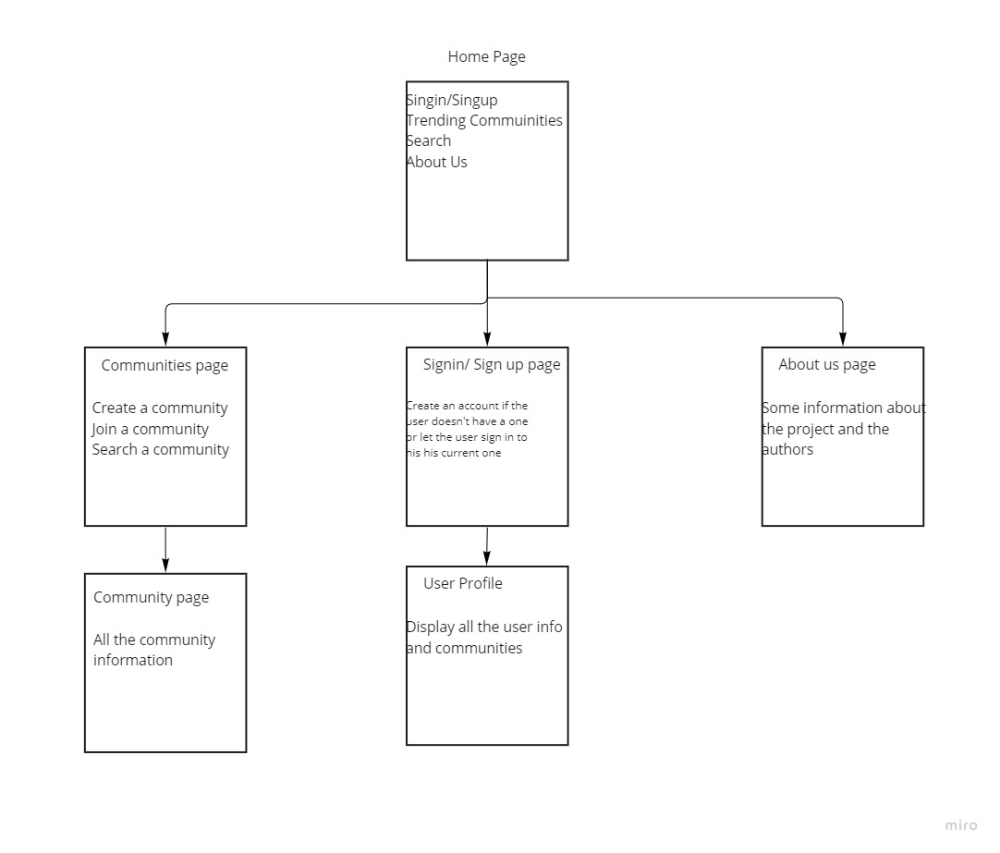
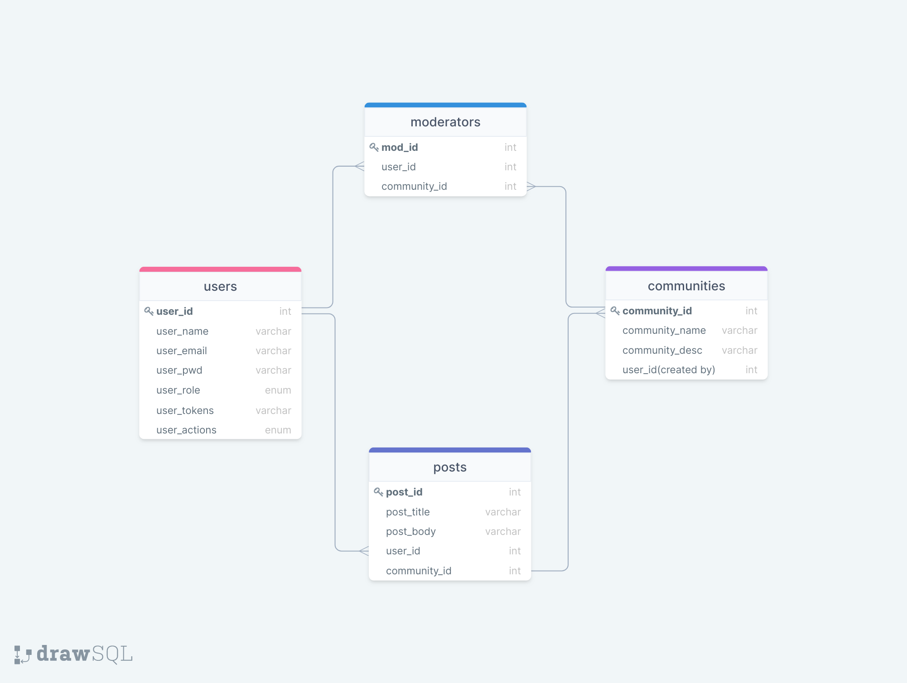

# iSupport

A habit building platform that connects communities that share the same goal together, offering them a wide range of features such as creating communities, progress tracking, solo-goals and statistics.

Team Name: **Error Makers**

## Team Members:

- Karam Al-Qinneh
- Moath Abu Hamad
- Obeida Akilan
- Salam Mustafa
- Hala Al-Masharfeh

## Project Wireframes

- Home Page WireFrame:  
  

- Browse Communities Page WireFrame:  
  

- Community Page WireFrame:  
  

## User Stories

> [User Stories](https://trello.com/b/dPPTjuco/project-management)

## Domain Modeling

## Database Schema Diagram

